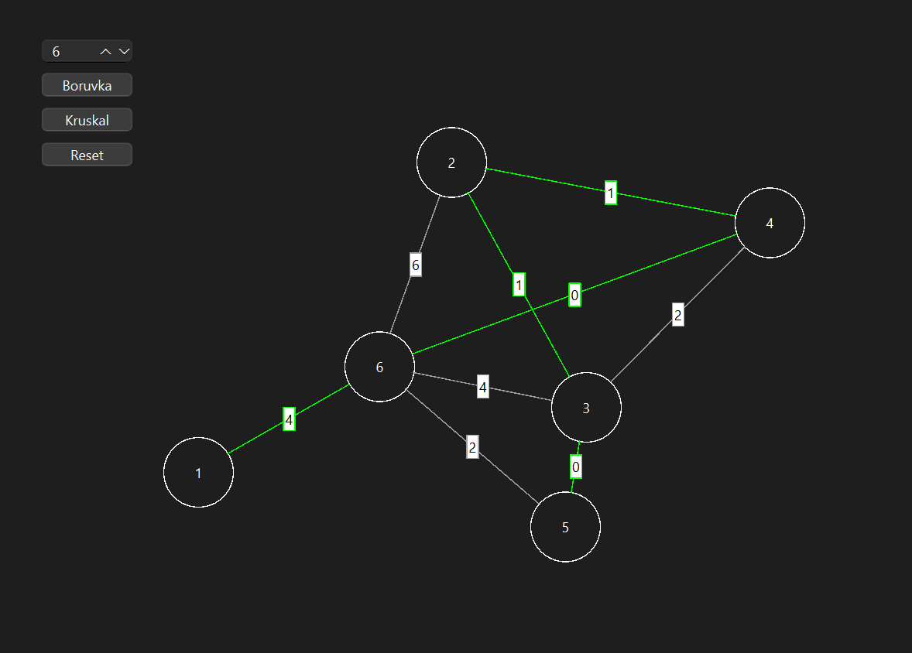

# Graph Visualization using Kruskal's and Boruvka's Algorithm

This project is a **Qt C++ application** that visualizes **Kruskal's and Boruvka's** algorithms for computing the **Minimum Spanning Tree (MST)** on a weighted graph. Users can create, modify, and visualize graphs interactively while applying these algorithms.

## Features

- **Interactive Graph Editing**
  - Add **nodes** by clicking on the canvas.
  - Create **edges** by selecting two nodes and assigning weights.
  - Drag nodes to reposition them.

- **Minimum Spanning Tree Visualization**
  - Apply **Kruskal's Algorithm** and **Boruvka's Algorithm** dynamically.
  - Visualize the MST with highlighted edges.
  - Display edge weights clearly.

- **Reset and Modify**
  - Clear and reset the graph to try different configurations and see the difference between the algorithms.

## Prerequisites

- **Qt Creator installed**
